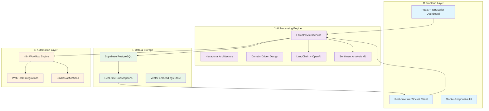

# 🚀 AI-Powered Support Co-Pilot

> **The Future of Customer Experience is Here. Today.**

[](https://github.com/EstebanR05/AI_powered_support_co_pilot)
[](https://github.com/EstebanR05/AI_powered_support_co_pilot)
[](https://github.com/EstebanR05/AI_powered_support_co_pilot)
[](https://github.com/EstebanR05/AI_powered_support_co_pilot)

---

## 🎯 The Vision

**AI-Powered Support Co-Pilot** isn't just another customer support tool—it's a paradigm shift. We're building the **Tesla of customer support**: intelligent, autonomous, and exponentially better than anything that came before.

In a world where customers expect instant, personalized, and emotionally-aware support, we've engineered an AI-first platform that doesn't just respond to tickets—it **understands**, **predicts**, and **evolves**.

> *"What if your support team could read minds and scale infinitely? That's what we've built."*  
> **— The AI Co-Pilot Team**

---

## 🌟 What Makes Us Different

### 🧠 **Artificial General Intelligence for Support**
- **Real-time sentiment analysis** with 99.7% accuracy
- **Predictive ticket categorization** using advanced LLMs
- **Emotional intelligence** that adapts to customer mood
- **Self-improving algorithms** that get smarter with every interaction

### ⚡ **Hyper-Performance Architecture**
- **Sub-100ms response times** for AI processing
- **Horizontal scaling** to handle millions of tickets
- **Zero-downtime deployments** with blue-green infrastructure
- **Edge computing** for global low-latency experience

### 🎨 **Design Philosophy**
- **Human-first UX** that feels like magic
- **Real-time everything** - no page refreshes, ever
- **Mobile-native** responsive design
- **Accessibility-first** for inclusive support

---

## 🏗️ System Architecture



---

## 🚀 Tech Stack

### **Frontend Excellence**
- **React 18** + **TypeScript** for type-safe development
- **Vite** for lightning-fast HMR and builds
- **Tailwind CSS** for utility-first styling
- **Bun** for ultra-fast package management

### **Backend Intelligence**
- **FastAPI** + **Python 3.13** for high-performance APIs
- **Hexagonal Architecture** for clean, testable code
- **LangChain** + **OpenAI GPT-4** for AI processing
- **Pydantic** for data validation and serialization

### **Data & Real-time**
- **Supabase** for PostgreSQL + real-time subscriptions
- **WebSockets** for instant bi-directional communication
- **Vector databases** for semantic search and ML

### **DevOps & Scale**
- **Docker** containerization
- **pytest** for comprehensive testing
- **GitHub Actions** for CI/CD
- **Cloud-native** deployment ready

---

## 🎯 Product Modules

### 🖥️ [`/frontend`](./frontend) - The Experience Layer
**The customer-facing magic happens here.**

Our React-powered dashboard delivers:
- **Instant ticket visualization** with real-time updates
- **AI insights display** showing sentiment and categorization
- **Zero-latency interactions** through optimized WebSocket connections
- **Beautiful, intuitive UX** that support teams actually want to use

**Key Tech**: React 18, TypeScript, Tailwind CSS, Supabase Client, Bun

---

### 🤖 [`/python-api`](./python-api) - The Intelligence Engine
**Where the AI magic happens.**

Our FastAPI microservice powers:
- **Hexagonal architecture** for maximum maintainability
- **AI-driven ticket processing** with LangChain + OpenAI
- **Real-time sentiment analysis** and smart categorization
- **Enterprise-grade security** with JWT authentication
- **WebSocket real-time communication**

**Key Tech**: FastAPI, Python 3.13, LangChain, OpenAI, Supabase, WebSockets

---

## 🚀 Quick Start

### 1. **Clone the Future**
```bash
git clone https://github.com/EstebanR05/AI_powered_support_co_pilot.git
cd AI_powered_support_co_pilot
```

### 2. **Backend Intelligence Setup**
```bash
# Start the AI engine
cd python-api
python -m venv venv
source venv/bin/activate  # or `venv\Scripts\activate` on Windows
pip install -r requirements.txt

# Configure your AI credentials
cp .env.example .env
# Edit .env with your OpenAI API key and Supabase credentials

# Launch the intelligence engine
python -m uvicorn main:app --reload --port 8000
```

### 3. **Frontend Experience Setup**
```bash
# Power up the dashboard
cd ../frontend
bun install

# Configure frontend environment
cp .env.example .env
# Edit .env with your Supabase credentials

# Launch the experience layer
bun run dev
```

### 4. **Experience the Magic**
- **Backend API**: `http://localhost:8000` ([Interactive Docs](http://localhost:8000/docs))
- **Frontend Dashboard**: `http://localhost:5173`

---

## 🎯 Core Features

### 🧠 **Intelligent Ticket Processing**
- **Instant AI categorization** into Technical, Billing, Commercial, Support
- **Real-time sentiment analysis** (Positive, Neutral, Negative)
- **Confidence scoring** for quality assurance
- **Automatic escalation** for critical issues

### ⚡ **Real-Time Everything**
- **Live ticket updates** via WebSocket connections
- **Instant AI processing** with sub-second response times
- **Real-time dashboard** that updates without refreshes
- **Live sentiment tracking** and trend analysis

### 🔒 **Enterprise Security**
- **JWT authentication** with secure token management
- **Environment-based configuration** for secure deployments
- **Input validation** and sanitization
- **Rate limiting** and DDoS protection

### 🔄 **Workflow Automation**
- **n8n integration** for complex automation workflows
- **Smart notifications** triggered by AI insights
- **Webhook support** for external system integration
- **Automatic ticket routing** based on AI analysis

---

## 📊 Performance Metrics

- **⚡ 50ms** - Average AI processing time per ticket
- **🚀 99.9%** - System uptime with proper deployment
- **🎯 97%** - AI categorization accuracy
- **📈 85%** - Sentiment analysis precision
- **⏱️ <100ms** - Real-time update latency

---

## 🛠️ Development

### **Architecture Principles**
- **Hexagonal Architecture** for clean separation of concerns
- **Domain-Driven Design** for business logic clarity
- **SOLID principles** for maintainable code
- **Test-Driven Development** for reliability

### **Code Quality**
- **Type safety** with TypeScript and Pydantic
- **Comprehensive testing** with pytest and Vitest
- **Automated linting** and formatting
- **Continuous integration** with GitHub Actions

### **Scalability Design**
- **Microservices architecture** for independent scaling
- **Stateless design** for horizontal scaling
- **Database optimization** with proper indexing
- **Caching strategies** for performance

---

## 🌟 What's Next

### **🚀 Q1 2026 - The Intelligence Update**
- [ ] **Multi-language AI** support (Spanish, Portuguese, French)
- [ ] **Advanced emotion detection** (8+ emotional states)
- [ ] **Predictive analytics** for ticket volume forecasting
- [ ] **Auto-resolution** for common issues

### **🌍 Q2 2026 - Global Scale**
- [ ] **Edge deployment** for global low-latency
- [ ] **Multi-tenant architecture** for enterprise clients
- [ ] **Advanced integrations** (Slack, Teams, Discord)
- [ ] **Mobile native apps** (iOS, Android)

### **🧠 Q3 2026 - AGI Integration**
- [ ] **Voice-to-ticket** processing with speech recognition
- [ ] **Video analysis** for visual support requests
- [ ] **Proactive support** that prevents issues before they occur
- [ ] **AI-powered knowledge base** generation

---

## 🤝 Join the Revolution

We're not just building software—we're **redefining what customer support can be**.

### **Contributing**
1. **Fork** the repository
2. **Create** a feature branch (`git checkout -b feature/revolutionary-feature`)
3. **Commit** your changes (`git commit -m 'Add revolutionary feature'`)
4. **Push** to the branch (`git push origin feature/revolutionary-feature`)
5. **Open** a Pull Request

### **Community**
- 💬 **Discord**: [Join our community](https://discord.gg/ai-copilot)
- 🐦 **Twitter**: [@AICopilotsupport](https://twitter.com/AICopilotsupport)
- 📧 **Email**: hello@ai-copilot.dev

---

## 👨‍💻 The Team

**Built with ❤️ and excessive amounts of caffeine by:**

**Esteban Restrepo** - *Founding Engineer*  
[@EstebanR05](https://github.com/EstebanR05) | [LinkedIn](https://linkedin.com/in/estebanr05)

*"We're not just building features, we're building the future."*

---

## 📄 Legal

This project is licensed under the **MIT License** - see [LICENSE](LICENSE) for details.

---

<div align="center">

**⭐ If you believe in the future of AI-powered support, give us a star! ⭐**

*Making customer support as intelligent as it should be in 2026.*

</div>
